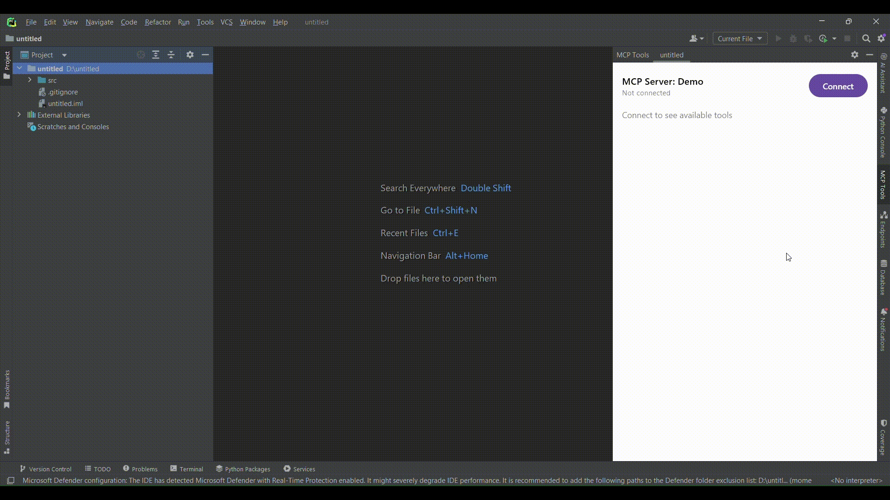

# MCP Inspector Lite

A lightweight PyCharm plugin for inspecting and testing Model Context Protocol (MCP) servers directly from your IDE.

## 🌟 Features

- 🔌 Connect to MCP servers with a single click
- 🔍 Auto-discover available tools from connected servers
- ⚡ Invoke tools with intelligent parameter parsing
- 📊 View real-time tool execution results
- 🎨 Modern Compose-based UI
- 🔧 Built-in diagnostics for troubleshooting



## 📋 Prerequisites

### Required

- **JDK 17** or higher
- **Python 3.12+** with the MCP package installed
- **PyCharm**

### Installing Python Dependencies

Install the Model Context Protocol package:

```bash
pip install mcp
```

Or if you're using Python 3:

```bash
pip3 install mcp
```

Verify the installation:

```bash
python -c "import mcp; print('MCP installed successfully')"
```

## 🚀 Getting Started

### 1. Clone the Repository

```bash
git clone https://github.com/yourusername/mcp-inspector-lite.git
cd mcp-inspector-lite
```

### 2. Configure JDK 17

Make sure you have JDK 17 installed and configured:

**Linux/Mac:**
```bash
export JAVA_HOME=/path/to/jdk-17
export PATH=$JAVA_HOME/bin:$PATH
```

**Windows:**
```cmd
set JAVA_HOME=C:\Path\To\jdk-17
set PATH=%JAVA_HOME%\bin;%PATH%
```

Verify Java version:
```bash
java -version
# Should output: openjdk version "17.x.x" or similar
```

### 3. Build the Plugin

Using Gradle wrapper (recommended):

```bash
./gradlew buildPlugin
```

Or on Windows:
```cmd
gradlew.bat buildPlugin
```

The plugin will be built to `build/distributions/mcp-inspector-lite-*.zip`

### 4. Install the Plugin

#### Option A: Install from Disk
1. Open PyCharm
2. Go to `Settings/Preferences` → `Plugins`
3. Click the ⚙️ icon → `Install Plugin from Disk...`
4. Select the built `.zip` file from `build/distributions/`
5. Restart PyCharm

#### Option B: Run in Development Mode
```bash
./gradlew runIde
```

This will launch a new PyCharm instance with the plugin installed.

## 🎯 Usage

### Opening the Tool Window

1. After installation, look for the **"MCP Tools"** tool window
2. It's usually on the right sidebar
3. Or use `View` → `Tool Windows` → `MCP Tools`

### Connecting to an MCP Server

1. Click the **"Connect"** button in the MCP Tools window
2. The plugin will automatically start the bundled demo server
3. Once connected, available tools will be displayed

### Invoking Tools

1. Each tool card shows:
    - Tool name and description
    - Parameter inputs with type hints
    - Required parameters are marked with `*`

2. Fill in the parameters:
    - **String**: `hello world`
    - **Integer**: `42`
    - **Boolean**: `true`, `false`, `yes`, `no`, `1`, `0`
    - **Array**: `[1, 2, 3]` or `1, 2, 3`
    - **Object**: `{"key": "value"}`

3. Click **"Invoke"** to execute the tool

4. Results appear below the tool card

### Disconnecting

Click the **"Disconnect"** button to stop the MCP server connection.

## 📁 Project Structure

```
mcp-inspector-lite/
├── src/main/
│   ├── kotlin/com/amirali/myplugin/mcpinspectorlite/
│   │   ├── models/              # Data models and sealed classes
│   │   │   └── McpModels.kt
│   │   ├── services/            # Services
│   │   │   ├── McpConnectionManager.kt
│   │   │   └── McpToolExecutor.kt
│   │   ├── client/              # MCP client infrastructure
│   │   │   ├── McpProcessManager.kt
│   │   │   └── McpResourceExtractor.kt
│   │   ├── util/                # Utilities and helpers
│   │   │   ├── ParameterParser.kt
│   │   │   └── McpDiagnostics.kt
│   │   └── ui/                  # User interface
│   │       ├── components/      # Reusable UI components
│   │       ├── viewmodel/       # ViewModel layer
│   │       └── McpToolWindow.kt
│   └── resources/
│       └── mcp/
│           └── server.py        # Bundled demo MCP server
└── src/test/
    └── kotlin/                  # Unit tests
```

## 🛠️ Configuration

### Using Custom MCP Servers

To connect to your own MCP server:

1. Place your server script in `src/main/resources/mcp/`
2. Rebuild the plugin

### Supported Server Types

The plugin currently supports:
- Python-based MCP servers (`.py`)
- Node.js-based MCP servers (`.js`)
- Java-based MCP servers (`.jar`)